# DietAndExerciseRecords

| 日期 | 早餐 | 午餐 | 晚餐 | 宵夜 | 运动(累计) | 体重 | 备注 |
| -------| ------- | ------- |------- |------- |------- |------- |------- |
|20240303|--||--|--| 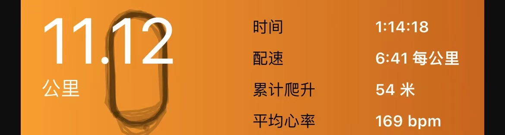 11.12km(44.85km)|--|--|
|20240302|--|--|||--|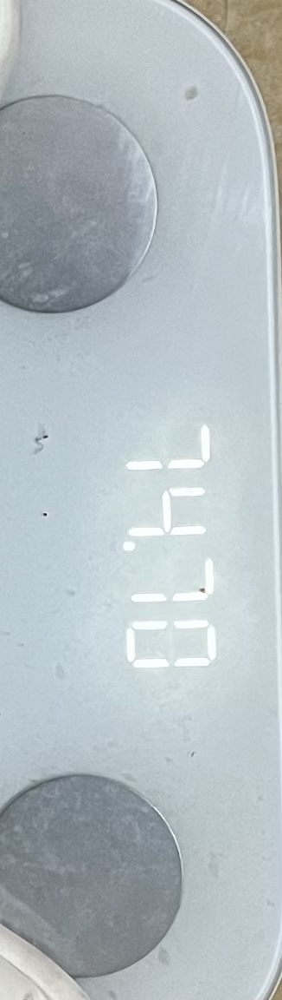 74.7kg|--|
|20240301| | --| 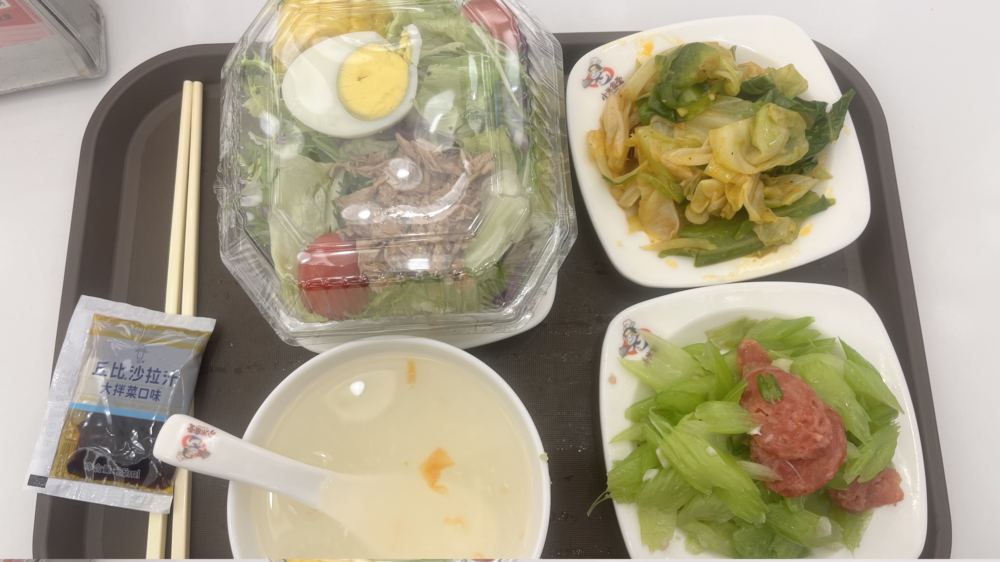 明天只吃一个素菜...|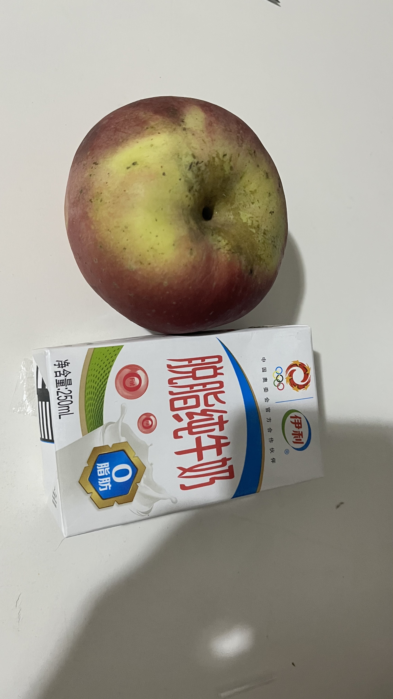|   4.08km(33.73km)  6.13km(29.65km)|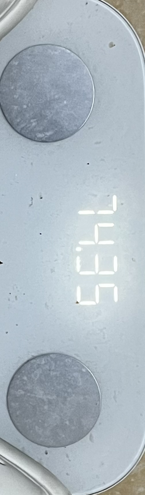 74.35kg|--|
|20240229| 明天卤蛋改为白水蛋| -- |  明天只吃一个素菜 |  这次零食吃完就不买了|   4.84km(23.52km) 英里换为公里  6.29km(18.68km)| 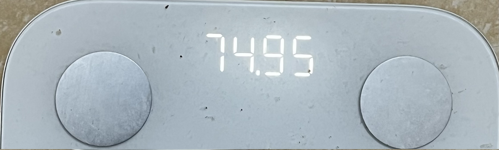 74.9kg | -- |
| 20240228 |  不该吃蛋炒饭| --  | 西红柿里面有糖... | 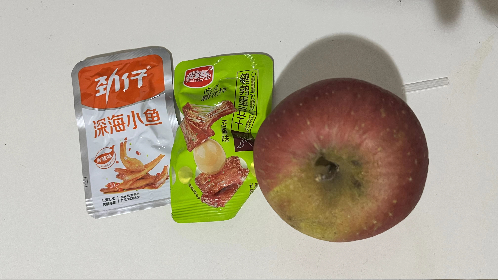 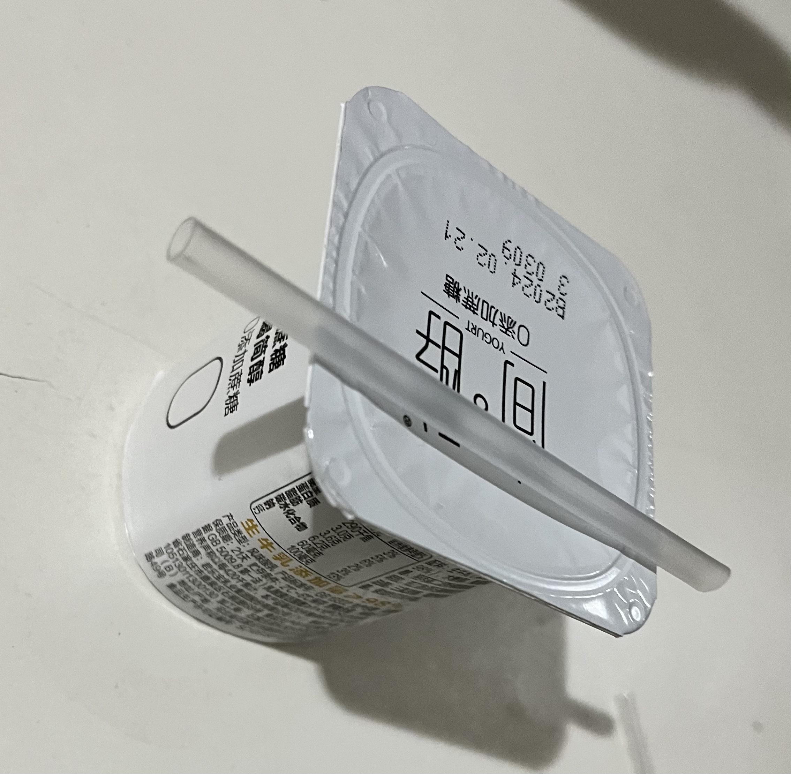 这次零食吃完就不买了|  6.22km(12.39km)  6.17km(6.17km)| 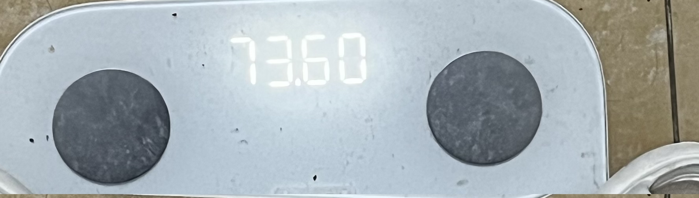 73.6kg| 周末采购减脂餐 |

# 饮食

- **减少**淀粉摄取、戒糖戒碳水、补充优质蛋白质。

| 早餐 | 午餐 | 晚餐 |
| ------- | ------- |------- |
|蛋白质+碳水+维生素+膳食纤维|蛋白质+碳水+膳食纤维|蛋白质+维生素+膳食纤维|
|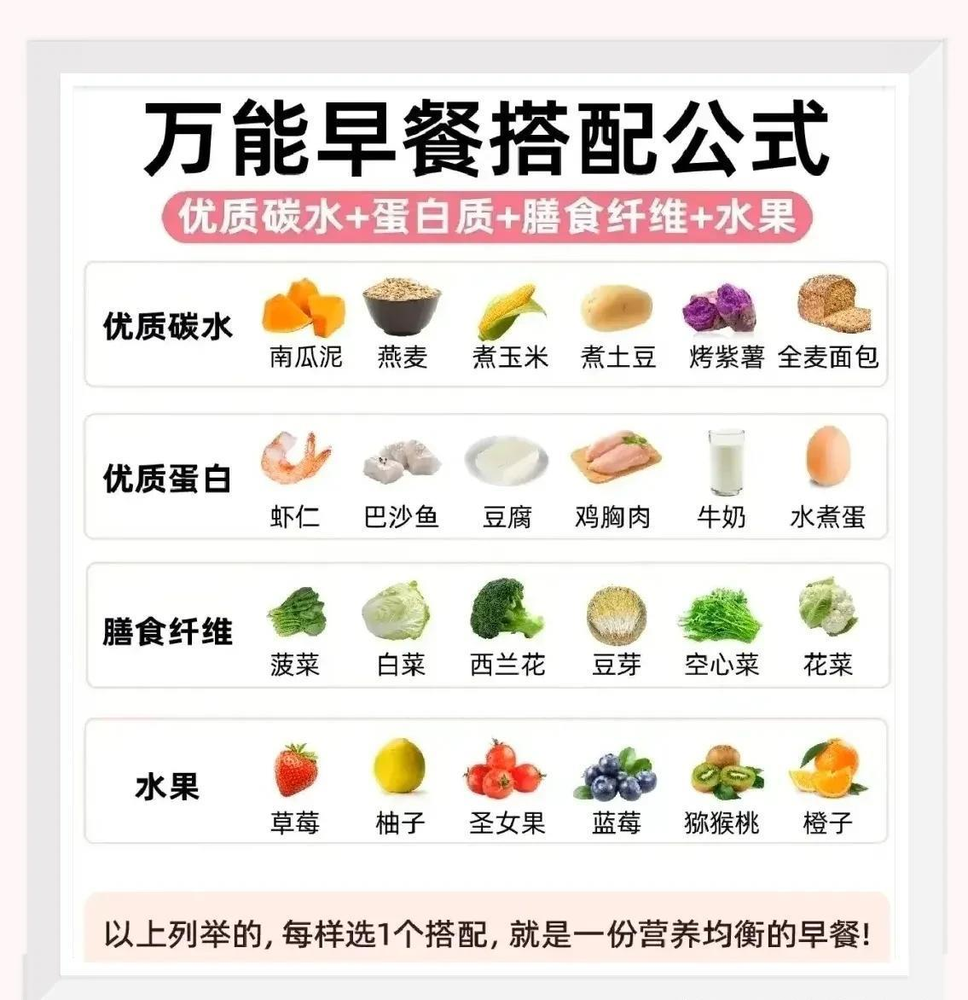 |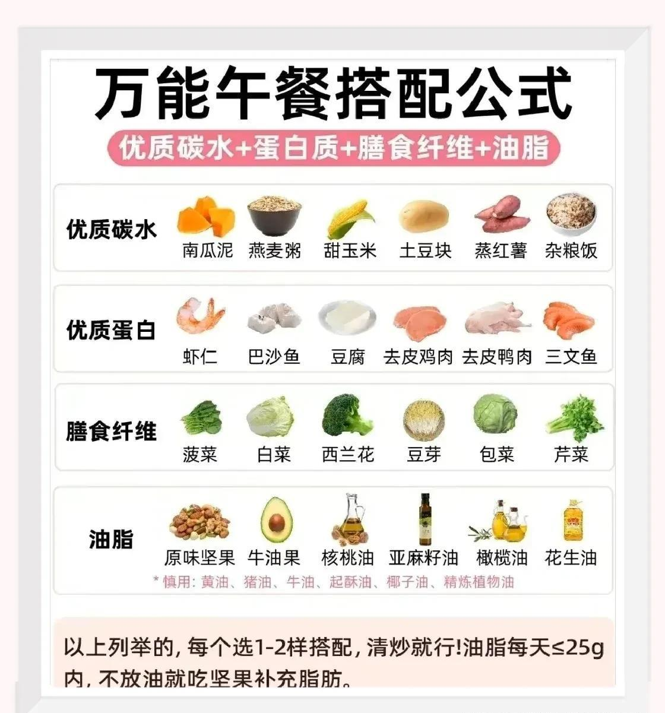 | 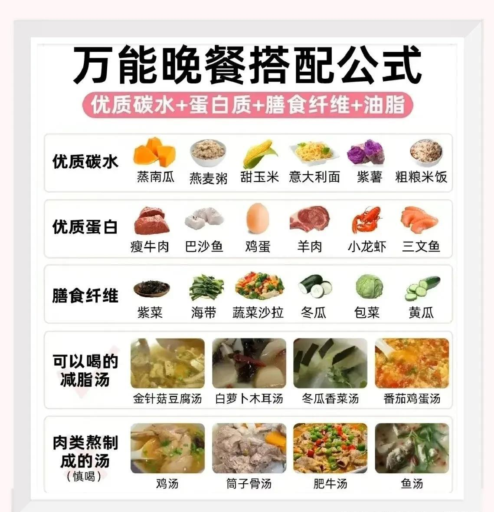|

- 优质碳水：荞麦、全麦、玉米、红薯、意大利面、紫薯、杂粮饭、土豆、南瓜、小南瓜、山药、燕麦、全麦面包等。
- 优质蛋白：牛排、瘦牛肉、鸡胸肉、鱼肉、鸡蛋、虾、猪瘦肉、羊肉、三文鱼、豆腐、脱脂牛奶、酸奶、豆浆等。
- 膳食纤维：黄瓜、芦笋、白菜、西兰花、番茄、冬瓜、生菜、菠菜、包菜、紫甘蓝、木耳、金针菇、杏鲍菇、豆芽、紫菜、海带、魔芋、姜丝、豌豆夹、芹菜、秋葵、青菜、油麦菜、胡萝卜、平菇、荷兰豆、丝瓜、蟹味菇、茄子、小番茄、香菇、白玉菇等。
- 维生素：草莓、苹果、猕猴桃、圣女果、柚子、火龙果、蓝莓、橙子、牛油果、腰果、香蕉等。
- 优质脂肪：橄榄油、原味坚果、牛油果、亚麻籽油等。
- 调味料：咖喱粉、孜然粉、辣椒粉、五香粉、蔬菜粉、胡椒粉、黑胡椒粉、生抽、味精、鸡精、大蒜、香菜、小米辣、柠檬汁、醋

减脂期每日的营养需求:

- 优质碳水：人体每公斤应摄入3～3.5克碳水，例如:60KG体重每日应摄入180g。
- 优质蛋白质：130～180g左右，每餐不能缺少的。
- 膳食纤维：每天500g以上，多吃绿叶蔬菜，膳食纤维丰富。
- 维生素：我们优选低糖水果，每日食用在200克左右，可以放在两餐之间。
- 多喝水，每天要1500～2500ml，能促进新陈代谢。

减脂≠减重，尤其是小基数的不要太纠结秤上的数字，主要看自己的维度。要合理安排三餐，养成规律的饮食习惯，每顿七八分饱，不要吃撑。每天的食材不要单一，饮食清淡。