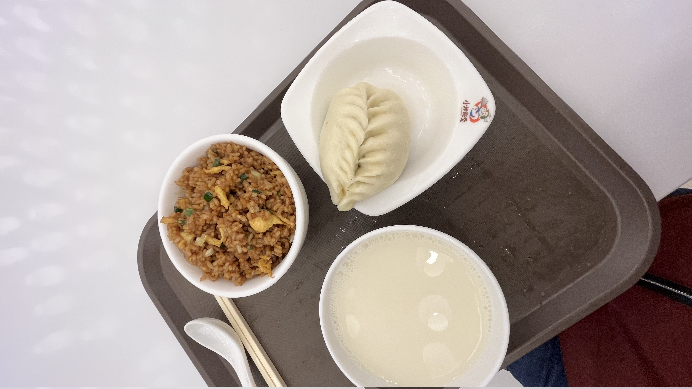

# Diet-exerciseRecords

| 日期 | <div style="text-align: center;">早餐</div>  | <div style="text-align: center;">午餐</div>  | <div style="text-align: center;">晚餐</div>  | <div style="text-align: center;">宵夜</div>  | <div style="text-align: center;">运动</div>  | <div style="text-align: center;">体重</div>  |
| -------| ------- | ------- |------- |------- |------- |------- |
| 20240228 | <div style="text-align: center;"><br><font color='red'>不该吃蛋炒饭</font> </div>   | -  | | | 10km| 76.2kg|
|


```bash
<mark>高亮</mark>
<font color='red'>红色</font> 
<font color='blue'>蓝色</font>
<span style='color:green'>绿色</span>
<div style="text-align: center;">居中</div> 
```